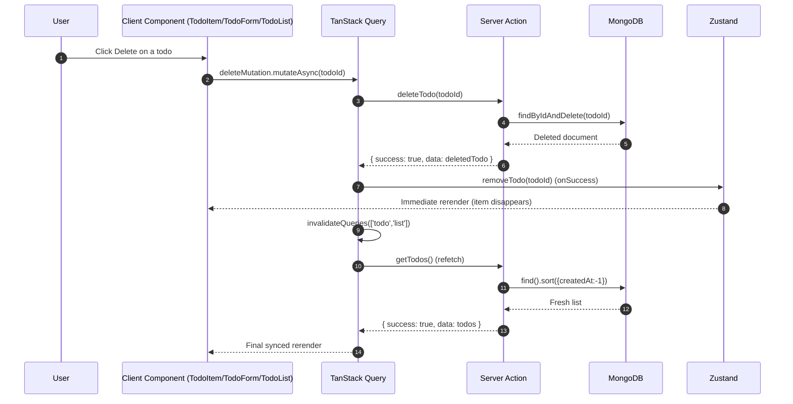
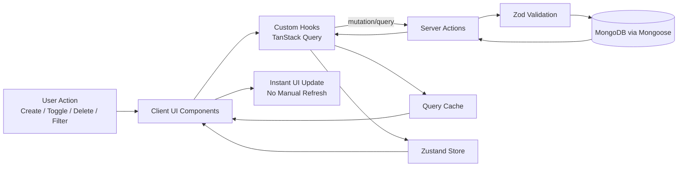

# TanStack Query + Zustand + Zod + Next.js TODO App

A production-style learning project that demonstrates how to build a full-stack TODO application with:
- Next.js App Router
- TanStack Query (server-state and async lifecycle)
- Zustand (client-state)
- Zod + React Hook Form (validation and form handling)
- MongoDB + Mongoose (persistence)
- shadcn/ui + Tailwind (UI)

This README is written as if you are explaining the project to a candidate in an interview.

## 1) What problem this project solves

This app supports:
- Creating TODOs
- Listing TODOs
- Filtering TODOs (`all`, `active`, `completed`)
- Toggling completion
- Deleting TODOs

The important engineering goal is not just CRUD. The key is real-time-feeling UX without manual refresh, while keeping data correct with the database.

## 2) High-level architecture

The project is split into clear layers:

- `app/*`:
  - Next.js app entry points and layout
- `components/*`:
  - UI components (`todo-form`, `todo-list`, `todo-item`, `todo-filter`)
- `hooks/use-create-todo.js`:
  - TanStack Query hooks (`useQuery`, `useMutation`)
- `store/todo-store.js`:
  - Zustand store for client-side shared state
- `actions/todo-actions.js`:
  - Server Actions (create/get/toggle/delete on DB)
- `model/todo.js` + `lib/db.js`:
  - Mongoose model and DB connection
- `validations/todo.js`:
  - Zod schema used on client and server

## 3) Responsibility of each library

### Next.js
- Gives server + client model in one codebase.
- `app/page.tsx` is a server component entry for the page.
- `actions/todo-actions.js` uses `'use server'` and runs on server.
- `app/layout.tsx` wraps client tree with global providers.

### TanStack Query
Used for **server state**:
- Fetching remote data (`useQuery`)
- Running mutations (`useMutation`)
- Caching results by query key
- Refetching after writes with `invalidateQueries`
- Exposing async flags (`isLoading`, errors, pending)

In this project:
- Query key: `['todo', 'list']`
- Fetch hook: `useTodos()`
- Mutations: `useCreateTodo()`, `useToggleTodo()`, `useDeleteTodo()`

### Zustand
Used for **client/shared state**:
- Current filter (`all/active/completed`)
- In-memory todo list copy
- Helper selectors (`activeCount`, `completedCount`, `filteredTodos`)

In this project, Zustand is used together with TanStack Query. This is okay for learning, but in production you usually avoid duplicating the same server list in two stores unless there is a strong reason.

### Zod
Used for runtime validation:
- `createTodoSchema` validates `title`, `description`, `priority`
- Client-side: via `zodResolver` in form
- Server-side: via `createTodoSchema.parse(data)` before DB write

This gives defense in depth. Even if client validation is bypassed, server validation still protects DB integrity.

### React Hook Form
- Efficient form state handling
- Integrates with Zod resolver
- Handles submit lifecycle and error messages with minimal boilerplate

### MongoDB + Mongoose
- Persistent storage of todos
- Mongoose schema defines shape and constraints
- `connectDB()` caches connection to avoid reconnect storms in dev/hot reload

### Sonner (Toast)
- Gives user feedback for create/delete/update success/failure

## 4) How data flows (end-to-end)

## Initial page load

1. `app/layout.tsx` mounts `QueryProvider`.
2. `QueryProvider` creates one `QueryClient` instance.
3. `TodoList` calls `useTodos()`.
4. `useTodos()` executes `getTodos()` server action.
5. Server action reads from MongoDB and returns serialized todos.
6. Query cache stores todos under `['todo', 'list']`.
7. Components re-render with data.

No manual refresh is needed because React Query updates subscribed components when cache updates.

## Create TODO flow

1. User submits form in `TodoForm`.
2. `useCreateTodo().mutateAsync(data)` runs.
3. Server action `createTodo(data)` validates with Zod.
4. On success, todo is inserted in MongoDB.
5. Mutation `onSuccess` calls `invalidateQueries(['todo','list'])`.
6. Active query refetches latest todos.
7. UI rerenders with new item.

## Toggle TODO flow

1. User clicks checkbox in `TodoItem`.
2. `useToggleTodo().mutateAsync(id)` runs.
3. Server action flips `completed` and saves.
4. On success, hook updates Zustand immediately (`updateTodo`).
5. Hook also invalidates query to sync from server truth.

Result: fast UI update + correctness.

## Delete TODO flow (the “why no refresh?” answer)

When user deletes:

1. `TodoItem` calls `deleteMutation.mutateAsync(todo._id)`.
2. Server action deletes record from MongoDB.
3. In `onSuccess` of mutation:
   - `removeTodo(id)` updates Zustand list immediately.
   - `invalidateQueries(['todo','list'])` marks cached list stale and refetches.
4. Components subscribed to Zustand/Query rerender instantly.

That is why deletion appears live without refresh:
- state update triggers immediate rerender
- query invalidation ensures backend-consistent final state

## 5) Why this feels “live”

There are 3 mechanisms working together:

1. **Reactive state subscriptions**
   - React components subscribe to Query and Zustand state.
   - Any cache/store change causes rerender.

2. **Mutation lifecycle callbacks**
   - `onSuccess` performs local state updates and cache invalidation.

3. **Query invalidation + refetch**
   - Guarantees data eventually matches DB, even if local state was stale.

So the UX is instant, but still consistent with server data.

## 6) Sequence diagram



## 7) Flow diagram (full feature map)



## 8) Folder-level explanation for interview

- `actions/todo-actions.js`
  - Server-side contracts for CRUD.
  - Includes `revalidatePath('/')` for Next cache revalidation semantics.

- `hooks/use-create-todo.js`
  - Defines query keys.
  - Encapsulates async behavior and mutation side-effects.
  - Keeps components thin.

- `store/todo-store.js`
  - Local state for filter/counts and local list operations.

- `components/todo-form.jsx`
  - Form UX, validation errors, submit handling.

- `components/todo-list.jsx`
  - Loading/error/empty states and rendering item list.

- `components/todo-item.jsx`
  - Per-item interactions (toggle/delete).

- `validations/todo.js`
  - Schema used across client+server.

- `lib/db.js` and `model/todo.js`
  - Connection strategy + domain model.

## 9) Key interview talking points

1. Server state vs client state
- TanStack Query is best for remote/server data.
- Zustand is useful for UI/global client data.

2. Why invalidate queries after mutation?
- To keep cache aligned with backend truth.
- Avoids stale data after write operations.

3. Why validate on both client and server?
- Better UX on client.
- Security/integrity on server.

4. Why no refresh needed?
- Subscribed components rerender on cache/store changes.
- Mutation side-effects update local state and refetch data.

5. Tradeoff in this implementation
- Todos are stored in both Query cache and Zustand (duplication).
- Works for learning; can be simplified in production.

## 10) Current behavior notes

- Create uses invalidation/refetch to show new item.
- Toggle/Delete use local Zustand updates + invalidation for fast+correct updates.
- Filtering is purely client-side (`all`, `active`, `completed`).

## 11) Running locally

1. Install dependencies:
```bash
npm install
```

2. Configure environment:
```env
MONGODB_URI=your_mongodb_connection_string
```

3. Start dev server:
```bash
npm run dev
```

4. Open:
- `http://localhost:3000`

## 12) Suggested production improvements

- Use either Query cache or Zustand for todo list source-of-truth (avoid duplication).
- Add optimistic updates with rollback (`onMutate`, `onError`) for even snappier UX.
- Add pagination/infinite query for large lists.
- Add auth + per-user todos.
- Add tests for hooks and server actions.

---
If you explain this README confidently, you are covering both practical implementation and the core state-management concepts interviewers look for.
